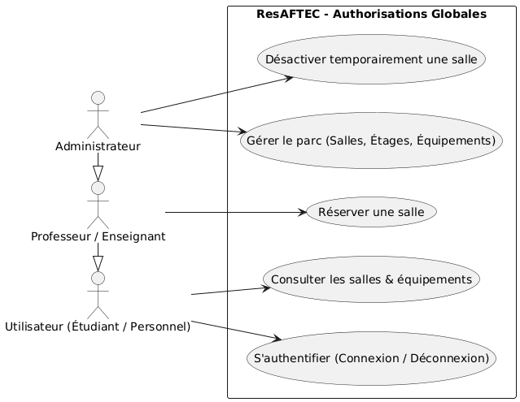
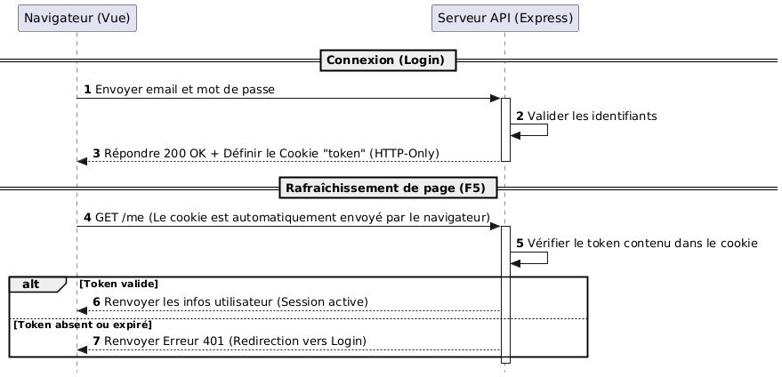
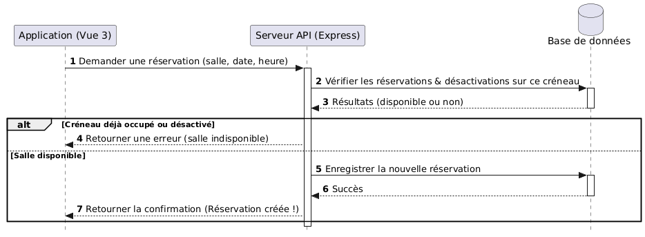
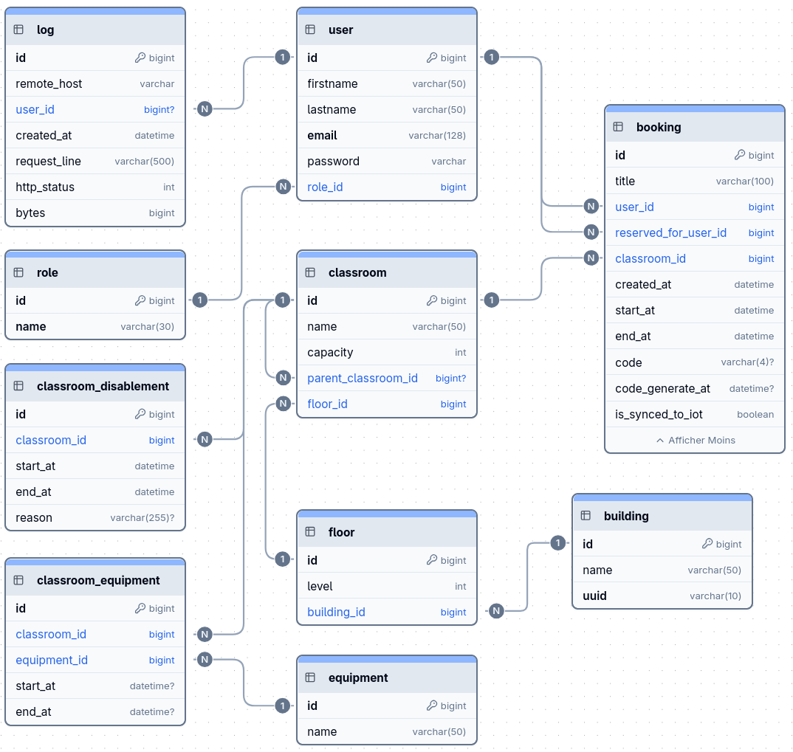

# 🏫 ResAFTEC - Système de Réservation de Salles

## 1. Présentation & Contexte

**ResAFTEC** est une application web de réservation de salles développée dans le cadre de mon BTS SIO. Elle permet aux utilisateurs (personnel et étudiants) de consulter les salles disponibles et d'effectuer des réservations (pour les utilisateurs autorisés : professeurs et administrateurs).

- **Objectif :** Moderniser la gestion des salles de l'établissement suite à la construction d'un nouveau bâtiment, en fournissant une interface intuitive pour les utilisateurs et un tableau de bord d'administration, tout en posant les bases d'un système de contrôle d'accès physique connecté.

---

## 2. Conception & Modélisation

### Cas d'Utilisation & Diagrammes

#### 1. Diagramme de Cas d'Utilisation Global

Ce diagramme détaille les différents rôles utilisateurs (Étudiant, Professeur, Administrateur) et leurs droits respectifs au sein de l'application.

<p align="center">
  
</p>

#### 2. Flux d'Authentification (Cookie HTTP-Only & JWT)

Ce diagramme décrit la phase de connexion ainsi que le processus de restauration automatique de session (via la route `/api/me`) lors d'un rafraîchissement de la page.

<p align="center">
  
</p>

#### 3. Flux de Réservation & Gestion des Conflits

Ce diagramme modélise l'algorithme de réservation d'une salle, incluant les vérifications successives de disponibilité, de désactivation de la salle, et d'équipements requis.

<p align="center">
  
</p>

### Modèle de Données

- **MCD (Modèle Conceptuel de Données) :**



### Maquettes (Wireframes)

- [Lien vers les maquettes (Penpot)](https://design.penpot.app/#/workspace?team-id=e7a86fff-661d-81c1-8008-10c6effa856d&file-id=e7a86fff-661d-81c1-8008-0f0d1efc859f&page-id=e7a86fff-661d-81c1-8008-0f0d1efc85a0)

---

## 3. Architecture & Contraintes Techniques

### Architecture Logicielle

- **Backend :** Node.js / Express / TypeScript. Architecture en couches (Routes, Contrôleurs, Services).
- **ORM :** TypeORM avec connexion à une base MariaDB.
- **Frontend :** Vue / Pinia / Tailwind CSS.

---

## 4. Guide d'Installation et Configuration

### Prérequis

- Node.js >= 18
- MariaDB
- Cloner le dépôt : `git clone https://github.com/Pierddev/ReservationSallesAFTEC.git`

### Variables d'Environnement

Créez un fichier `.env` à la racine du dossier `apps/backend/` en vous basant sur le fichier `.env.example` fourni :

| Variable      | Description                                                  | Valeur par défaut       | Obligatoire |
| ------------- | ------------------------------------------------------------ | ----------------------- | ----------- |
| `PORT`        | Port d'écoute du serveur Node.js                             | `3000`                  | Non         |
| `DB_HOST`     | Hôte de la base de données MariaDB                           | `localhost`             | Oui         |
| `DB_PORT`     | Port de la base de données                                   | `3306`                  | Non         |
| `DB_NAME`     | Nom de la base de données                                    | —                       | Oui         |
| `DB_USER`     | Nom d'utilisateur de la base de données                      | —                       | Oui         |
| `DB_PASSWORD` | Mot de passe de l'utilisateur base de données                | —                       | Oui         |
| `JWT_SECRET`  | Clé secrète pour la signature et vérification des tokens JWT | —                       | Oui         |
| `URL_SITE`    | URL du frontend (utilisée pour la configuration CORS)        | `http://localhost:5173` | Oui         |

**Exemple de fichier `.env` :**

```env
PORT=3000
DB_HOST=localhost
DB_PORT=3306
DB_NAME=res_aftec
DB_USER=res_app
DB_PASSWORD=your_db_password
JWT_SECRET=YOUR_JWT_SECRET
URL_SITE=http://localhost:5173
```

### Configuration de la Base de Données

Avant de lancer le projet, vous devez créer la base de données et l'utilisateur dans MariaDB. Connectez-vous à votre invite de commande MariaDB/MySQL en tant que `root` :

```bash
mariadb -u root -p
```

Puis exécutez les commandes SQL suivantes pour créer la base de données, l'utilisateur et lui accorder tous les privilèges nécessaires (en cohérence avec votre fichier `.env`) :

```sql
-- Création de la base de données
CREATE DATABASE IF NOT EXISTS `res_aftec` CHARACTER SET utf8mb4 COLLATE utf8mb4_general_ci;

-- Création de l'utilisateur de l'application (changez 'your_db_password' par votre mot de passe, et reportez le dans le .env)
CREATE USER IF NOT EXISTS 'res_app'@'localhost' IDENTIFIED BY 'your_db_password';

-- Attribution des privilèges sur la base de données
GRANT ALL PRIVILEGES ON `res_aftec`.* TO 'res_app'@'localhost';

-- Rechargement des privilèges
FLUSH PRIVILEGES;

-- Quitter
EXIT;
```

### Installation du projet

```bash
# Cloner le dépôt
git clone https://github.com/Pierddev/ReservationSallesAFTEC.git

cd ReservationSallesAFTEC/

# Installer les dépendances nécessaires au fonctionnement du projet
npm run install:all

# Créer le fichier de configuration .env
cp apps/backend/.env.example apps/backend/.env

# Éditer le fichier
nano apps/backend/.env
```

### Initialisation du Backend

```bash
cd apps/backend/

# Exécuter les migrations pour créer les tables dans la base de données
npm run migration:run

# Peupler la base de données avec quelques données de test
npm run seed

# Lancer le serveur du backend en mode développement
npm run dev
```

### Initialisation du Frontend

Dans un autre terminal :

```bash
cd apps/frontend/

# Lancer le serveur du frontend en mode développement
npm run dev
```

## 5. Commandes Personnalisées

### Commandes Racine

| Commande | Description |
|---|---|
| `npm run install:all` | Installe toutes les dépendances (root + backend + frontend) |
| `npm run test` | Lance les tests Jest |
| `npm run test:cov` | Lance les tests avec couverture |

### Commandes Backend

| Commande | Description |
|---|---|
| `npm run dev` | Démarre le backend en mode développement (compilation watch + rechargement auto) |
| `npm run migration:generate` | Génère une nouvelle migration TypeORM |
| `npm run migration:run` | Exécute les migrations en attente |
| `npm run migration:revert` | Annule la dernière migration |
| `npm run seed` | Peuple la BDD avec les données de test |
| `npm run seed:dev` | Efface et peuple la BDD avec les données de test |

### Commandes Frontend

| Commande | Description |
|---|---|
| `npm run build` | Compile le frontend pour la production (vérification TypeScript incluse) |
| `npm run test` | Lance les tests Vitest (mode watch) |
| `npm run test:run` | Lance les tests Vitest (une seule exécution) |
| `npm run test:cov` | Lance les tests avec couverture |